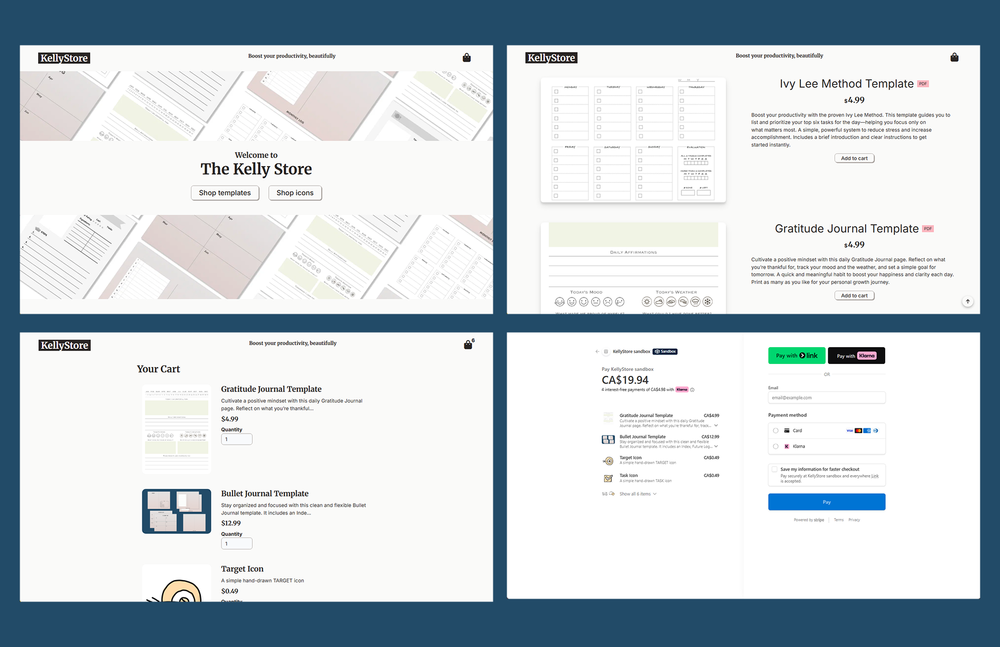
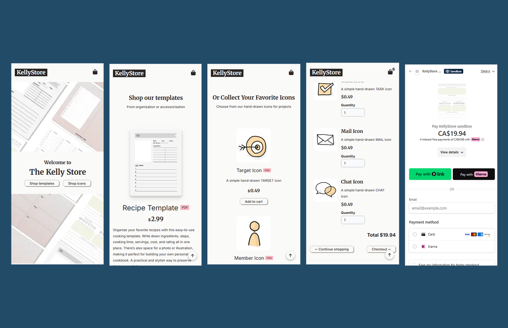

# KellyStore | E-Commerce Web App [➚](https://main.d3vz3aed5z659y.amplifyapp.com/ "Click to launch KellyStore")

### 📸 Screenshots




---

## 💡 Overview

**KellyStore** is a full-stack e-commerce web application for **printable PDF productivity templates** and **hand-drawn PNG icons** designed to motivate creativity and organization.

Although my background is primarily front-end development, this project marks a major milestone into **full-stack engineering**, including:

- **Secure Stripe checkout** via server-side API routes
- **AWS Amplify hosting** for both frontend + backend (Netlify incompatible due to backend endpoints)
- Real storefront experience using Stripe Test Mode⚡
*(no real charges, but checkout + dashboard logs are 100% functional)*

This app brings together design, UX, and real-world payment processing in one polished product.

<br/>

## 🛍 Products Include

- **Printable PDF templates**
  - Ivy Lee Method Template
  - Bullet Journal Template
  - Gratitude Journal Template
- **Minimal hand-drawn PNG icons**
  - Goal, Idea, Milestone, ...

More items coming soon!

<br/>

## 🚀 Key Features

- Full shopping cart functionality (add / update / remove items)
- **Stripe Checkout** powered by secure API routes
- Responsive layout optimized for all devices
- Server-rendered product data from Stripe
- Email subscription UI for future engagement
- Simple, elegant UX with lightweight styling

<br/>

## 🛠 Tech Stack

| Layer | Technology |
|------|------------|
| Frontend | **Next.js 14 (App Router), React** |
| Styling | TCSS, FantaCSS |
| Backend | Next.js Route Handlers (serverless) |
| Payments | Stripe API |
| Deployment | AWS Amplify |

<br/>

## 🔐 Stripe Payment Flow

```
flowchart LR
User --> Cart --> Checkout
Checkout -->|POST line items| API_Route
API_Route --> Stripe
Stripe -->|RedirectToCheckout| HostedPaymentPage
Stripe -->|Success / Cancel| App
```

<br/>

## 🧩 What I Learned

- Secure server-side Stripe integration with **Checkout Sessions**
- Mapping multiple Stripe **Prices** per **Product**
- Managing cloud environment variables & CI/CD deployment
- Data-driven UI updates using React Context API
- Better UX for digital product purchasing

<br/>

## 🎯 Future Roadmap

- Auto-delivery of downloadable files
- Auth + purchase history
- Product filtering + categories
- Stripe Webhooks for fulfillment automation

<br/>

## ▶ Live Demo

🔗 https://main.d3vz3aed5z659y.amplifyapp.com/

---

[🔼 Back to Top](#kellystore--e-commerce-web-app-)
